# PRD — AI Chat Features (Investment, SIP & Obligations)

**Status:** Accepted — domain interview Round 8 complete  
**Owner:** Product owner + engineering  
**Last updated:** 2026-06-07  
**Related:** [AI_PRINCIPLES.md](./AI_PRINCIPLES.md), [DOMAIN_GLOSSARY.md](./DOMAIN_GLOSSARY.md), [PROJECT_CONTEXT.md](./PROJECT_CONTEXT.md), [decisions/002-financial-persona.md](./decisions/002-financial-persona.md)

---

## 1. Summary

Finance Copilot has a strong **Accounts** domain (investments, SIP tracking, loans, net worth) but a **thin chat layer** for those capabilities. This PRD defines three delivery slices plus a **financial persona** layer that personalizes drill-downs, footer suggestions, and proactive nudges — with all numbers from Ledger tools, not the LLM.

---

## 2. Problem

| Capability (Accounts/API) | Chat today |
|---------------------------|------------|
| Invested / Current / P&L | Not queryable; net worth card shows holdings total only |
| MF one-time vs SIP + schedule | No intent; planner `create_account` lacks SIP fields |
| SIP paid/pending + history | `mf_sip_schedule` exists; no chat tool or card |
| FD/RD maturity | Fields on Account; no chat intent |
| Loan EMI schedule | Partial via `debt_payoff_planner` |
| `investment_allocation` | Reads legacy **`Asset`** table, not `Account` holdings |
| CC due day, recurring bills | Not unified in obligations view |
| Record SIP / transfer | User may mis-route as `add_expense` |
| Personalization | No per-user persona for nudges or dashboard filtering |

---

## 3. Goals

1. **Portfolio dashboard in chat** — cash + holdings + physical assets; liquidity / value / P&L rankings; pie + bar visuals.
2. **SIP discipline** — last paid, next expected, “Already paid in {Month}”.
3. **Obligations hub** — grouped SIP / EMI / bills / CC due days.
4. **Affordability** — subtract **all** committed outflows.
5. **Capture loop** — dual-leg transfer confirm (bank + MF).
6. **Persona** — rules + post-session LLM summary; user-editable; drives nudges and footer suggestions.

## 4. Non-goals

- Live NAV / market feeds (manual `current_value` remains).
- Buy/sell recommendations or specific fund picks.
- Tax filing; 80C hints are rules-only nudges, not advice.
- Bank sync, shared household budgets.
- Autonomous writes without confirm card.

---

## 5. Owner decisions (Round 8 — canonical)

| Area | Decision |
|------|----------|
| **Portfolio scope** | Cash (bank + wallet) + Account holdings (MF, FD, RD, stock, EPF) + physical **`Asset`** rows |
| **Liquidity order** | bank/cash/wallet → stock → MF → RD → FD → EPF → physical Asset |
| **Most valuable** | Sort by **current value** (fallback txn balance, label “as per ledger”) |
| **Most profitable** | **Both** P&L **%** and P&L **₹** (separate bar charts / lists) |
| **Dashboard UX** | Primary **`investment_portfolio_dashboard`** + drill-down intents; hide empty sections; **footer** with NW-increasing suggestions |
| **Advice** | Facts + deterministic NW suggestions (all types in glossary); no buy/sell |
| **SIP status** | Last paid on · next expected on · “Already paid in {Month}” |
| **Record SIP** | **Dual-leg** confirm: bank debit + MF credit |
| **Affordability** | Subtract loans + SIPs + recurring bills + CC commitments |
| **Obligations** | One **`obligation_list`** card, grouped sections |
| **Proactive nudges** | Chat + Accounts; expand later |
| **Persona** | DB markdown/JSON; rules + LLM after session; Settings editor; see ADR 002 |

---

## 6. Delivery slices

```mermaid
flowchart LR
  subgraph slice1 [Slice 1 — Investment gap]
    A[Fix investment_allocation → Account]
    B[portfolio_dashboard + drill-downs]
    C[sip_status + missing_data]
    D[fd_maturity_query]
    P[Persona v1 — rules only]
  end
  subgraph slice2 [Slice 2 — Obligations hub]
    E[obligation_list card]
    F[Affordability + all commitments]
    G[loan_emi_summary]
    P2[Persona LLM + Settings edit]
  end
  subgraph slice3 [Slice 3 — Capture]
    H[record_transfer dual-leg]
    I[Chat-guided import]
    J[create_account API parity]
  end
  slice1 --> slice2 --> slice3
```



### Slice 1 — Investment gap (P0) · 1–2 weeks

| ID | Feature | Intent | Card | Acceptance |
|----|---------|--------|------|------------|
| S1.1 | Fix allocation source | `investment_allocation` | `investment_pie_chart` | Pie from `HOLDINGS_TYPES` + `Asset`; not empty for MF-only users |
| S1.2 | Portfolio dashboard | `portfolio_summary` | `investment_portfolio_dashboard` | Hero totals; liquidity list; top by value; footer suggestions |
| S1.3 | P&L drill-down | `portfolio_pnl_drilldown` | bar chart card | Top performers by **%** and **₹** |
| S1.4 | Allocation drill-down | `investment_allocation` | `investment_pie_chart` | By type + optional top accounts |
| S1.5 | SIP status | `sip_status_query` | `sip_schedule_summary` | Last paid / next / “Already paid in {Month}” |
| S1.6 | SIP nudges | extend `missing_data` | hints | Missed SIP when debit day passed, no txn this month |
| S1.7 | FD/RD maturity | `fd_maturity_query` | inline or drill-down | Computed maturity from `start_date` + `tenure_months` |
| S1.8 | Persona v1 | — | — | Rule-derived fields only; filter empty dashboard sections |
| S1.9 | Planner + glossary | — | — | Keyword routes; `LLM_PROVIDER=none` |

**Slice 1 acceptance:**

- [x] “How are my investments?” → dashboard matching Accounts API totals ±0.
- [x] Cash, holdings, and physical assets appear when user has them; sections with zero stake hidden.
- [x] Footer shows at least one NW-increasing suggestion when gaps exist (e.g. no MF → “Add a mutual fund”).
- [x] SIP status copy matches glossary for paid / unpaid current month.
- [x] Tests: Ledger unit + `test_chat_api` per intent.

### Slice 2 — Obligations hub (P1) · **DONE**

| ID | Feature | Intent | Card | Status |
|----|---------|--------|------|--------|
| S2.1 | Upcoming obligations | `upcoming_obligations` | `obligation_list` | ✅ Done |
| S2.2 | Loan EMI summary | `loan_emi_summary` | section in obligation or debt card | ✅ Done |
| S2.3 | Affordability + commitments | `affordability_check` | `affordability_result` | ✅ Done |
| S2.4 | Create recurring from chat | `create_recurring_bill` | confirm → REST | ✅ Done |
| S2.5 | Post-import bill suggestions | — | CTA from `recurring_suggestions` | ✅ Done |
| S2.6 | Persona LLM + Settings | — | user-editable persona | ✅ Done |

**Affordability formula change:**  
`safe_surplus = income − spending − loan_emis − sip_emis − recurring_bills − cc_commitments`  
then apply existing safe-EMI ratio logic on remainder.

### Slice 3 — Capture & onboarding · **DONE** ✅

| ID | Feature | Intent | Card | Status |
|----|---------|--------|------|--------|
| S3.1 | Record transfer / SIP | `record_transfer` | `transaction_confirm` (dual-leg preview) | ✅ Done |
| S3.2 | Guided import | `import_statement` | `import_guide` | ✅ Done |
| S3.3 | Account setup parity (SIP/EPF) | `create_account_guided` | `account_create_confirm` | ✅ Done |
| S3.4 | Explain / recategorize | `explain_transaction`, `recategorize_transaction` | `transaction_detail`, `transaction_confirm` | ✅ Done |

---

## 7. Portfolio dashboard — functional spec

### 7.1 Data payload (Ledger → card)

```text
totals: { invested, current, pnl_amount, pnl_percent }
by_liquidity: [{ rank, bucket, label, current_value, account_ids }]
by_value: [{ name, type, current_value, invested, pnl_percent, pnl_amount }]
by_pnl_percent: [... top N ...]
by_pnl_amount: [... top N ...]
pie_by_type: [{ name, value }]
pie_by_account: [{ name, value }]  // top 5 + Other
physical_assets: [{ name, asset_type, current_value }]
cash_total: number
footer_suggestions: [{ action, label, reason }]  // deterministic
persona_hints: { hide_sections[], prioritize_drilldowns[] }  // optional
```

### 7.2 Visual design

- Reuse **`SpendingDashboardCard`** patterns: conic pie, horizontal bar chart, theme chart colors.
- Primary card: hero **Current** total + Invested + aggregate P&L.
- Drill-down cards on follow-up intents (E2 pattern).
- Mobile: single column; charts scale like spending dashboard.

### 7.3 NW-increasing suggestions (footer — all enabled)

1. Increase SIP when affordability shows surplus  
2. Pay high-interest debt first (highest loan/CC cost heuristic)  
3. Update stale `current_value` on holdings  
4. Log missing salary / SIP / EMI (`missing_data`)  
5. Move idle bank cash to FD/RD (informational)  
6. 80C / tax-saving nudge (rules-only, no product pick)

---

## 8. SIP status — functional spec

Per SIP account (`mutual_fund` + `investment_mode=sip`):

| Field | Rule |
|-------|------|
| `last_paid_on` | Latest qualifying transfer txn date |
| `next_expected_on` | Next `due_day` on or after today if unpaid this month |
| `status_label` | **Already paid in {Month}** if qualifying txn in current calendar month |
| `sip_paid_count` / `pending` | From `compute_sip_schedule` |

---

## 9. Record transfer — functional spec

**Confirm card shows:**

1. Bank account (parent): amount **−X**, `nw_impact=transfer`, merchant e.g. “SIP — {MF name}”  
2. MF account: amount **+X**, `nw_impact=transfer`  
3. Same date; user can adjust before confirm  

**Validation:** parent linked; amount &gt; 0; not classified as spending.

---

## 10. Obligations hub — functional spec

Single card, sections:

| Section | Source |
|---------|--------|
| **SIPs** | MF SIP accounts — `due_day`, amount, paid status this month |
| **Loan EMIs** | `loan` accounts — `emi_amount`, schedule from `loan_schedule` |
| **Recurring bills** | `RecurringBill` rows |
| **Credit cards** | `due_day` on account (even without RecurringBill) |

Sort by next due date within section. CC due day is informational.

---

## 11. Financial persona

See [002-financial-persona.md](./decisions/002-financial-persona.md).

**Slice 1:** Rule-based persona (account mix, missing-data flags, category skew from Ledger).  
**Slice 2:** Post-session LLM merge + Settings editor + nudge copy personalization.

**Uses:**

- Hide portfolio sections with no stake  
- Prioritize drill-down suggestions  
- Tailor proactive nudge wording on Accounts + chat  

---

## 12. Architecture (must)

- UI → `orchestrator.py` → Ledger → optional Insight → UI Guide → card.
- New intents + card types in `schemas.py`.
- Mutations: confirm card only.
- `LLM_PROVIDER=none`: keyword routes for all Slice 1 intents.
- Persona: never substitute for Ledger numbers.

### New schema additions

**Intents:** `portfolio_summary`, `portfolio_pnl_drilldown`, `sip_status_query`, `fd_maturity_query`, `loan_emi_summary`, `upcoming_obligations`, `record_transfer`

**Card types:** `investment_portfolio_dashboard`, `investment_pnl_bars`, `sip_schedule_summary`, `obligation_list`

---

## 13. Success metrics

| Metric | Target |
|--------|--------|
| Portfolio totals vs Accounts API | ±0 |
| Planner routing (test phrase set) | ≥90% |
| Dashboard renders with `LLM_PROVIDER=none` | 100% Slice 1 |
| Dual-leg transfer confirm | Both legs created atomically |
| Persona edit persists | Settings round-trip |

---

## 14. Risks

| Risk | Mitigation |
|------|------------|
| Dual-leg partial write | Single DB transaction; rollback both |
| Persona drift / wrong tone | User edit; rules baseline always |
| CC commitment undefined | Fallback: outstanding or recurring row; open question in PROJECT_CONTEXT |
| Over-long dashboard | Persona hides empty sections; drill-downs on demand |

---

## 15. Test plan

| Layer | Scope |
|-------|--------|
| Unit | Portfolio aggregate, liquidity sort, P&L rankings, SIP month status, affordability commitments |
| Integration | `test_chat_api.py` per intent |
| E2E | Chat portfolio dashboard; dual-leg confirm (Slice 3) |
| Regression | Existing spending / NW unchanged |

---

## 16. Revision history

| Date | Change |
|------|--------|
| 2026-06-07 | Initial draft |
| 2026-06-07 | Round 8 interview — accepted; open questions resolved |
